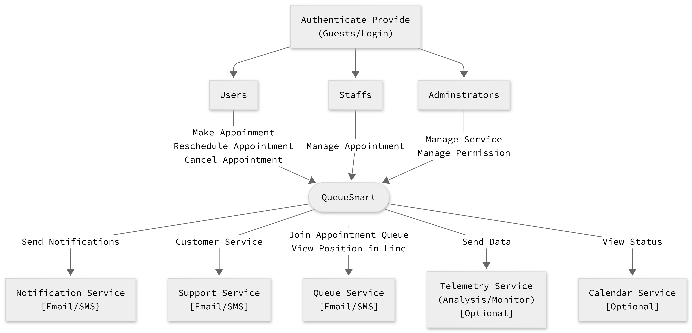

# QueueSmart Quickstart

[Mermaid](https://github.com/mermaid-js/mermaid) is used to create and generate diagrams for this project.

## Initial Thoughts

QueueSmart is designed to optimize the waiting experience for customers across various service environments. Users—such as students, customers, or citizens—interact with the software through an intuitive interface, allowing them to check in personally using their smartphones or on-site devices. Users have the ability to join a queue for a service, monitor their live status, and receive real-time updates regarding their position and estimated wait times. Managers (administrators) can configure and register available services, manage active queues, monitor analytics, and generate reports.

### Key Features
- **User Experience & Accessibility:** An intuitive, accessible interface supporting self-service check-in, queue visualization, cancellation options, and automated notifications via SMS, email, or push alerts.
- **Admin Dashboard:** A centralized dashboard providing a comprehensive view of active services and queues, with tools to edit services, manage waiting users, adjust queue states, and schedule maintenance downtime.

### System Considerations & Challenges
- **Scalability & Concurrency:** The system must reliably handle high-volume queues with hundreds to thousands of simultaneous requests without performance degradation.
- **Dynamic Wait Time Estimation:** An algorithm is required to predict accurate wait times that dynamically adjust to real-world service rates.
- **Administrative State Handling:** The application must gracefully handle administrative actions—such as pausing, modifying, or terminating a service—determining whether to process remaining users before closure or clear the queue, while broadcasting announcements to inform affected users of any changes.

## Development Methodology
###2.1 Methodology
Our team will follow an Agile development methodology using Scrum-style practices. We will divide the QueueSmart project into smaller tasks and develop the system incrementally throughout the semester. Team members will work on assigned tasks while communicating regularly and using GitHub to track and integrate their contributions.

###2.2 Why Agile is Appropriate
Agile is appropriate for QueueSmart because the system contains several interconnected features, including queue management, appointments, notifications, dynamic wait-time estimation, and administrative controls. As we develop and evaluate these features, some requirements or design decisions may need to be refined. An iterative Agile approach allows us to identify issues early and make improvements without having to redesign the entire project at once.

## High-Level Design / Architecture

### System Context Diagram

**Explain:** The users got to login in their account for role authentication to access page. And depend on the login user, regular customer will access the schedule appointment page. Meanwhile, the staff and admin dashboard would be view different as they have the authority to manage the appointment and service. When each role take action in their page, it'll call on the queue-smart system that trigger the service that either send notification to the users or have other service available for the users to interact. 

### Container Diagram

## Acknowledgements

Gemini is used to enhance the grammar and improve the overall quality of the documentation.
